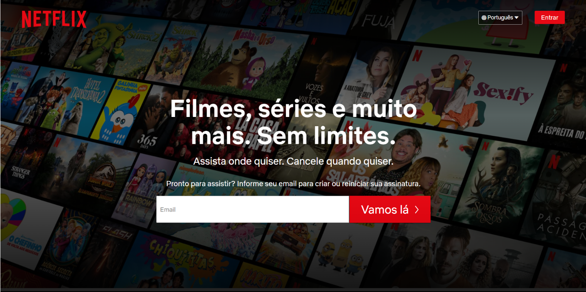
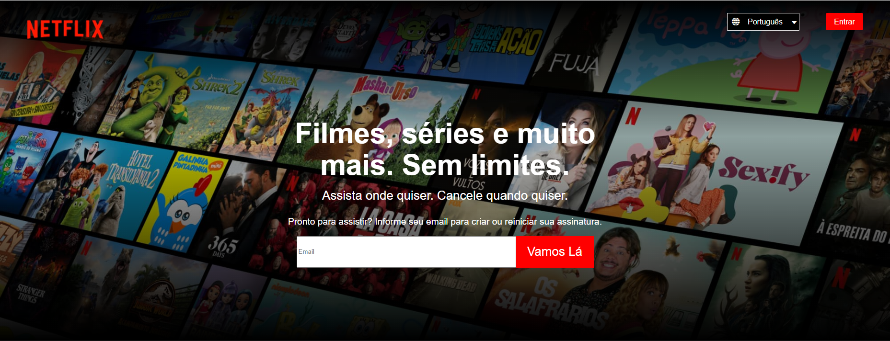

# Desafio-HTML-CSS

## Participantes: [André Reliquias](https://github.com/AndreReliquias) e [Igor Deo Alves](https://github.com/IgorDeo)

Este desafio foi proposto dentro do programa de formação da Investtools em 2021 e tinha como objetivo a avaliação do nível de cada um dos participantes com HTML e CSS.

O desafio consistiu em escolher alguma página da intenet e replicar o seu layout somente com HTML e CSS.

Essa foi a primeira experiência real de ambos os participantes com HTML e CSS. Tivemos algumas dificuldades, como o ajuste do vídeo dentro das imagens e a animação da seção de perguntas frequentes, porém conseguimos contorná-las com muita pesquisa e ajuda do mentor.

**OBS: Algumas diferenças de posicionamento se dão por conta do tamanho de tela ao realizar o print**

## Header da página escolhida(clique na imagem para o print da página completa)

## Header da nossa versão(clique na imagem para o print da página completa)

